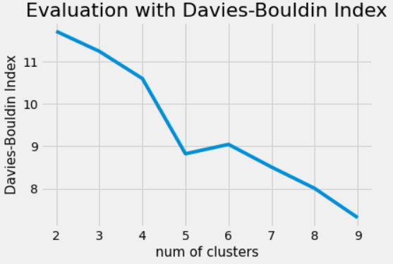

# Are my clusters correct? Methods for Unsupervised Evaluation of Clustering

### How can I know if my clustering is descriptive of a dataset? 
### How Do I Measure Performance When Supervised Labels are Not Available? 

 

## Read about 
* Unspuervised Clustering Evaluation Metrics
  - Math:  &ensp; $CH = \frac{Tr(B)}{Tr(W)}\frac{n-k}{k-1}$
  - Intuition
  - Instructions
* Practical Example on a [Real Dataset](https://scikit-learn.org/0.19/datasets/twenty_newsgroups.html).
  - Evaluation Plots
  - Visualization
* Conclusions

 

 